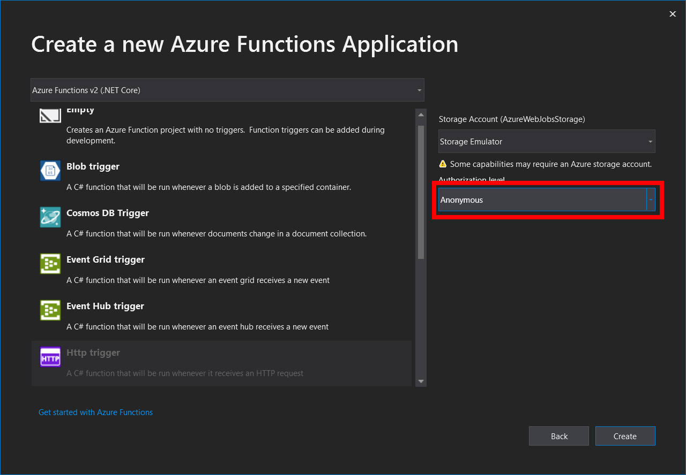

# Zadanie 3

**Twoja firma zatrudnia wielu pracowników. Coraz większym problemem staje się proces onboardingu. Zapadła decyzja, żeby spróbować zautomatyzować ten proces jak najmniejszym nakładem pracy. Wykorzystaj Azure Functions, żeby zaprojektować i zaimplementować takie rozwiązanie. Wymagania, jakie powinien spełniać projekt zostały wypisane poniżej.**

* Odebranie danych z formularza 
* Zapisanie danych do poszczególnych kolejek 
* Odebranie danych z kolejki i wyslanie maila - SendGrid \(wymagane wygenerowanie klucza API\) 
* Odebranie danych z kolejki i zapisanie danych do table storage 
* Hosting statycznej strony html w Storage Blob oraz stworzenie proxy**\***
  * Stworzenie Blob Storage i ustawienie go na static website 
  * Wrzucenie na static website plików z formularzem 
  * Dodanie proxy do Azure Functions

Uruchamiamy Visual Studio i tworzymy nowy projekt - Azure Functions.

### Funkcja 1 - ReceiveDataFromForm.cs

W kolejnym kroku tworzymy pierwszą funkcję do obsługi zapytania i wysłania danych do dwóch kolejek. Nadajemy jej nazwę, po czym wybieramy odpowiedni trigger - HttpRequest. Będzie się on wyzwalał w momencie gdy wyślemy zapytanie na określony adres URL. Dla uproszczenia wybieramy Authorization Level: Anonymous.

Authorization level pozwala nałożyć autoryzacje na funkcje. Są 3 poziomy autoryzacji:

* Anonymous - funkcja dostępna publicznie
* Function - autoryzacja odbywa się na podstawie klucza przypisanego do poszczególnej funkcji \(Function Key\)
* Admin - autoryzacja odbywa się na podstawie klucza przypisanego do danego Function App \(Master Key\) 

Następnie instalujemy biblioteki potrzebne przekazania wiadomości do kolejek oraz obsługi wysyłki maili.

Kolejnym krokiem będzie utworzenie modelu, za pomocą którego nastąpi deserializacja danych z Body requestu.

Mając model możemy już pobrać dane z zapytania, następnie je zwalidować i przesłać do odpowiednich kolejek.

### Stworzenie kolejek lokalnie

Dla uproszczenia stworzymy kolejki lokalnie za pomocą programu Azure Storage Explorer.

Aby przetestować stworzoną funkcję należy uruchomić Azure Function App lokalnie. W konsoli dostaniemy informacje o funkcjach oraz ich adresach.

Do wysłania zapytania możemy skorzystać z programu Postman lub wykorzystując gotowy formularz. W przypadku wykorzystania gotowego formularza należy wstawić adres URL funkcji w pliku /js/main.js.

Następnie uruchamiamy formularz \(index.html\) i wysyłamy przykładowe dane.

W przypadku błędu związanego z regułami CORS należy dodać politykę CORS do pliku local.settings.json.

Następnie za pomocą Azure Storage Explorer sprawdzamy czy dane zostały zapisane pomyślnie do kolejek.

### Funkcja 2 - SaveToTableStorage.cs

Kolejnym krokiem będzie dodanie funkcji, która odbiera wiadomości z kolejki tableQueue i zapisuje dane do Table Storage.

Następnie wybieramy odpowiedni trigger - Queue Trigger i podajemy ConnectionString oraz nazwę tabeli z której funkcja będzie odbierała wiadomości.

Aby dodać dane do Table Storage należy stworzyć odpowiedni obiekt dziedziczący z klasy TableEntity.

Klasa TableEntity dostarcza takie pola jak RowKey oraz PartitionKey, które są niezbędne do przechowywania danych w Table Storage.

PartitionKey - jest wykorzystywany do partycjonowania danych, na potrzebny np. rozkładania ruchu pomiędzy poszczególnymi instancjami Table Storage.

RowKey - unikalny identyfikator w obrębie danej partycji. Połączone PartitionKey oraz RowKey tworzą klucz główny każdego rekordu w tabeli.

Wykorzystując stworzony wcześniej model pobieramy dane z kolejki, następnie je deserializujemy do encji Table Storage. Należy pamiętać, żeby w parametrach funkcji wskazać Output z funkcji, który w tym przypadku będzie obiektem CloudTable wskazującym docelową tabelę do której dane zostaną zapisane. Ostatnią rzeczą przed dodaniem danych jest ustawienie ParitionKey oraz RowKey. 

Ostatnią rzeczą jaką należy zrobić przed uruchomieniem funkcji jest stworzenie lokalnej tabeli o nazwie onboardingtable za pomocą programy Azure Storage Explorer.

Aby przetestować stworzoną funkcję uruchamiamy Azure Function App, ponownie wypełniamy formularz oraz sprawdzamy zawartość tabeli za pomocą Azure Storage Explorer.

### Funkcja 3 - SendEmail.cs

Ostatnia funkcja będzie odpowiedzialna za odebranie wiadomości z drugiej kolejki i wysłanie maila na wskazany adres email za pomocą SendGrid.

Podobnie jak w przypadku poprzedniej funkcji wybieramy Queue Trigger, zmieniając jedynie nazwę kolejki z której funkcja będzie pobierać wiadomości.

W nowo stworzonej funkcji dodajemy Output, którym będzie SendGridMessage udostępniony z biblioteki SendGrid. Aby połączyć się z usługą SendGrid należy w atrybucie argumentu podać ApiKey usługi SendGrid. Następnie do wiadomości przypisujemy nadawcę, odbiorcę, temat oraz treść wiadomości.

Aby kompletnie połączyć funkcję z usługą SendGrid należy wygenerować darmowy klucz API na oficjalnej stronie SendGrid. \(wymagane jest założenie konta\)



Następnie utworzony klucz API należy dodać do pliku local.settings.json.

Aby przetestować stworzoną funkcję uruchamiamy Azure Function App, ponownie wypełniamy formularz oraz sprawdzamy skrzynkę mailową na podanym wcześniej adresie email.

